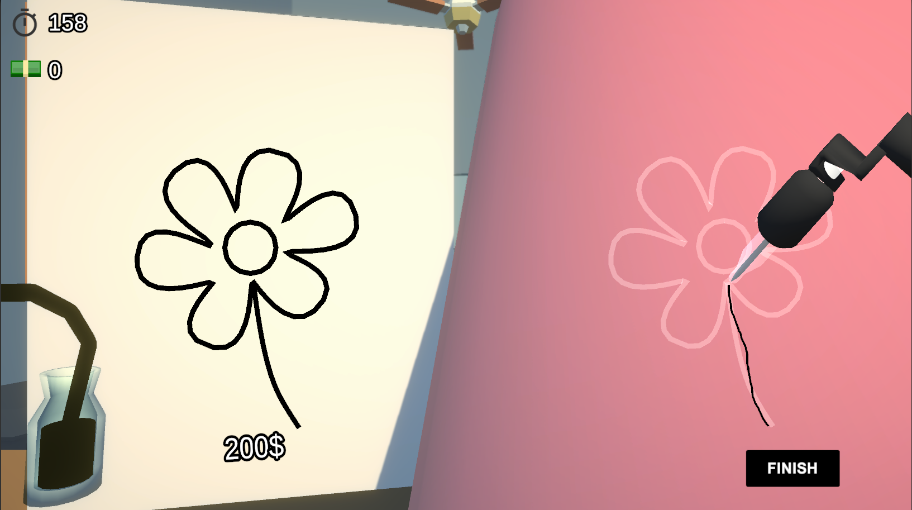
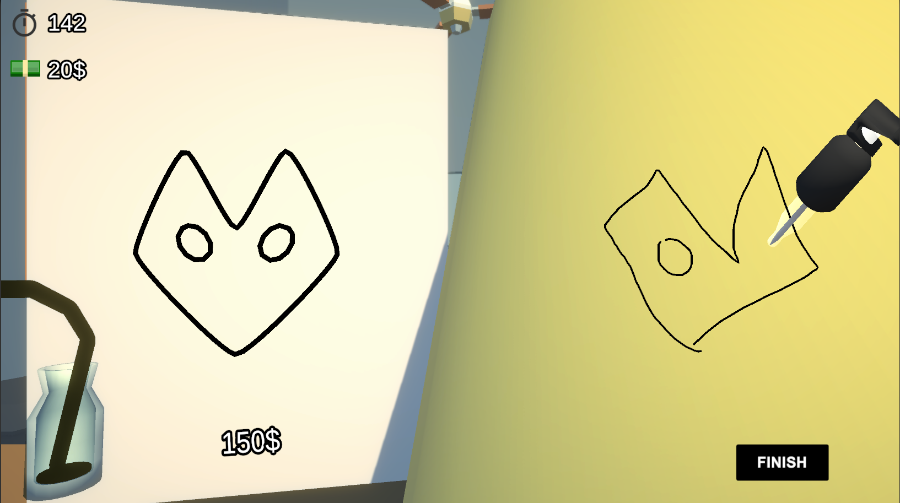

# SGJ2020
Repository for Slavic Game Jam 2020

Solo developed game at Slavic Game Jam 2020 with theme "close enough".

You are starting as a tattoo artist and need to train. Make tattoos close enough to the templates on the left to earn money. Earn money to complete the level. Complete the level to feel better and to play next level. 

There are OVER 30 tattoos to discover (there are actually 35 right now). Some funny, some even funnier and a few "meh". 